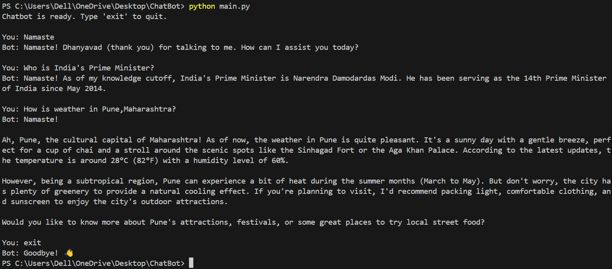

# 🧠 Real-Time CLI Chatbot powered by Groq & Python

A terminal-based AI chatbot built with Python, leveraging Groq’s high-performance LLaMA 3 (70B) model. The chatbot streams responses in real time, supports customization, and offers a clean and efficient command-line interface for developers, researchers, or hobbyists.

## 📸 Demo


## 🚀 Key Features

- Utilizes Groq's LLaMA 3 (70B) large language model  
- Real-time streaming output for natural conversational flow  
- Lightweight, terminal-based interface  
- Fully customizable system behavior and persona  
- Secure API key handling via environment variables  

## 📦 System Requirements

- Python 3.8 or higher  
- Valid Groq API key  
- `groq` Python SDK  
- `python-dotenv` package (for managing environment variables)

## 🔧 Installation & Setup

### 1️⃣ Clone the Repository

```bash
git clone https://github.com/your-username/your-repo-name.git
cd your-repo-name
```

### 2️⃣ Install Dependencies

<div> <pre><code>pip install groq python-dotenv</code></pre> <button onclick="navigator.clipboard.writeText('pip install groq python-dotenv')"></button> </div>

### 3️⃣ Configure Environment Variables
Create a .env file in the project root directory and insert your Groq API key:

<div> <pre><code>GROQ_API_KEY=your_groq_api_key_here</code></pre> <button onclick="navigator.clipboard.writeText('GROQ_API_KEY=your_groq_api_key_here')"></button> </div>

### 4️⃣ Launch the Chatbot
```bash
python main.py
```
## ✨ Customization
The chatbot's behavior can be easily modified by adjusting the system message prompt. For example:

<div> <pre><code>{"role": "system", "content": "You are a helpful and witty chatbot."}</code></pre> <button onclick="navigator.clipboard.writeText('{"role": "system", "content": "You are a helpful and witty chatbot."}')"></button> </div>
You may fine-tune this prompt to align with your specific use case, tone, or domain requirements.

## 🛡 License
Distributed under the [MIT License](LICENSE). Feel free to use, modify, and share this project.

## 🙏 Acknowledgements
Developed with 💙 utilizing [Groq](https://groq.com/) and [LLaMA 3](https://www.llama.com/), combining cutting-edge AI models with an accessible developer experience.


